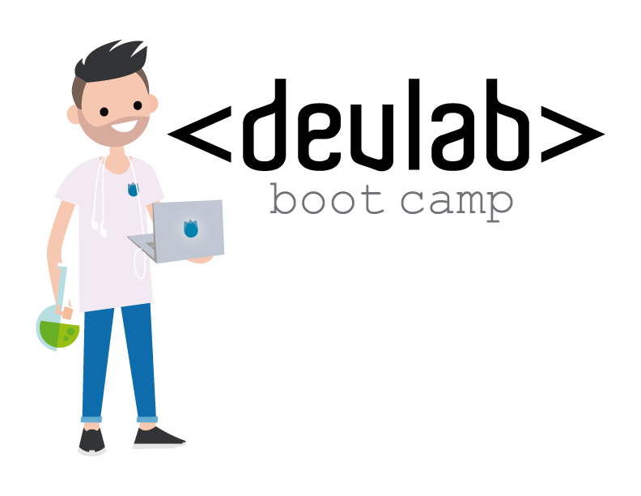

#Node.js + Express + Handlebars

#HTML & CSS

Para esta practica debemos hacer uso del ultimo navegador Chrome o Firefox para desarrollar. Intente utilizar la mayor cantidad posible de sintaxis de ECMAScript 6 para hacer uso del nuevo mundo que nos ofrece o continuar con la versión actual de ECMAScript.

##Lectura:
1. Principiante: Eloquent JavaScript 2nd Edition.
2. Un poco mas avanzado: Speaking JavaScript: An In-Depth Guide for Programmers
3. Lectura recomendada: devdocs.io mirar los siguientes CSS, DOM, DOM Events, HTML y Javascript.

##Documentación Adicional:
1. MDN JavaScript Reference: https://developer.mozilla.org/en/JavaScript/Reference
2. Understanding ECMAScript 6: https://leanpub.com/understandinges6/read
3. ECMAScript2015:  ECMAScript® 2015 Language Specification
4. JSONP and CORS: http://json-p.org/ - http://www.html5rocks.com/en/tutorials/cors/
5. Chrome console debug: https://developer.chrome.com/devtools/docs/co

## How To

Logra correr la linea base solo en 3 pasos y comenzar el nivel!

1. Asegurarse de tener instalado [NodeJS](https://nodejs.org/) y [npm](https://www.npmjs.com/).
2. Ingresar en la terminal : npm install.
3. Iniciar proyecto: npm start.
